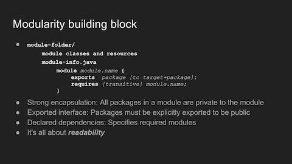

# What's New in Java 9
## Cleveland Java Meetup - July 19, 2017

## Slides and Notes

### SLIDE: 1

* It's more than just another version, it's a new JRE/JDK.

### SLIDE: 2

* In order to answer that question:
* I'll go through a condensed version of the official features list
* Drill-down on selected features from the condensed version
* Demo a bit of code, and other things.

### SLIDE: 3

* Oracle identifies two key changes.
* Version-String Schema seems an odd sort of choice for a key change. Perhaps because version stings can play a major role in build systems, and version specific code is scattered throughout the codebase.
* $MAJOR Released every two to three years.
* $MINOR Smaller releases for bug fixes and minor adjustments. Reset to zero when a new major version is released.
* $SECURITY is really interesting. Incremented with every minor release that “contains critical fixes including those necessary to improve security” and is not reset when $MINOR increases.
* There's lots more to say aboutJava Platform Module System, but let's continue down the list

### SLIDE: 4

* JShell - REPL stands for read-evaluate-print-loop.  A number of scripting languages like Python and Ruby have REPLs that allow for rapid learning and exploration.  Java now offers the same.
* jlink - Creating custom runtime images is just so cool, it's impossible not to mention it.  
* Think IoT.
* Hopefully, we'll learn more at some future meetup.

### SLIDE: 5

* The way Oracle talks and acts, they must believe G1 is the ultimate garbage collector.
* Improved user experience - G1 runs frequent collections that are limited to small time slices.  Garbage is collected in many small bites, rather than less frequent larger gulps.
* Unified JVM logging sould be very helpful debugging and troubleshooting.

### SLIDE: 6

* If you shell out, and need better control of PIDs, Java 9 has you covered.
* Who's against smaller strings?
* The of() method is as cool as you need to create immutable lists, maps, and/or sets?
* We'll see why Unsafe has gone away later.
* Memory ordering fencing is necessary because most modern CPUs employ performance optimizations that can result in out-of-order execution.

### SLIDE: 7

* I know I'd like to hear more about private interface methods, especially why.
* I would also like to know more about Nashorn. Don't think many of us use JavaScript inside our code.  Are we missing something?
* Multi-resolution images have been available for iOS and Android for years, to name a few.
* HiDPI on Windws and Linux eliminates scaling images small on those platforms because 300 pixels on a non-HiDPI display is about half the size when compared to a HiDPI display.
* Don't do enough internationalization to know how important going from Unicode 6.2 to 8.0 is.

### SLIDE: 8

* Modules make sense at scale.
* Modules are built using strong encapsulation, well-define interfaces, and explicit dependencies. We'll get to these shortly.
* Before Java 9, modularity wasn't possible, basically because of the classpath.
* The classpath destroys JAR groupings. All public classes become available once the JAR is loaded onto the classpath.

### SLIDE: 9

* Pressure was building over the years to address the problems with the runtime.
* Java 8 compact profiles:
* You have to move up to the next level, even if you only need one of its classes
* compact1 - Smallest profile with Java core classes and logging and scripting APIs.
* compact2 - Extends compact1 with XML, JDBC and RMI APIs.
* compact3 - Extends compact2 with security and management APIs.
* Project Jigsaw to the rescue.
* Think about the amount of work involved with:
* rearranging the codebase
* deciding the public interface
* defending choices on what is hidden.
* Once again, custom runtime images:
* How is it done? 
* What are the limits?
* I know I sure would like to know more.

### SLIDE: 10

* So, how is the wonderful trick performed?
* Modules are made up of the module-folder and the module-info.java file.
* All the classes and resources that make up the module are contained in the module-folder
* The module-info.java file specifies the public interface with the `exports`, and dependencies with `requires`
* Readability - In order to access exported packages from another module, you must require it. In other words, you must be able to "read" the other module.  
* Transitive `requires` allows you to make something you require in your module, transitively available to another module. For instance, if you require java.logging in your module, and you want to make the instance of your logger available to another module, the second module must require java.logging in its own module-info.java. However, if you declare a `transitive requires` in your module descriptor, the other modules implicitly `requires` it.
* Not sure I fully understand the usefullness of this, but "qualified exports" allow you to limit exporting to specific modules using the `to` clause.

### SLIDE: 11

* Hopelessly enamored with the phrase, "computing the transitive closure of the dependency graph"
* Elaborate phrase, short explanation.
* You don't need to migrate your old code in order to run on Java 9 thanks to the wonders of the unnamed module
* We need to hear more about the actual migration process. Oracle has a document: [Migrating to Oracle JDK 9](https://docs.oracle.com/javase/9/migrate/toc.htm#JSMIG-GUID-7744EF96-5899-4FB2-B34E-86D49B2E89B6)

### SLIDE: 12

* See demo notes below

### SLIDE: References

* __Java 9 Modularity__ (Mak & Bakker) and __Java 9 for Programmers__ (Deitel and Deitel) are both excellent. __Java 9 for Programmers__ has an overstanding walkthrough of JShell.
* __Modular Programming in Java 9__ (Kothagal) and __Java 9 with JShell__ (Hillar) are less thorough, but are nevertheless good introductions.

## Demo

### Code

The code is intended for demo purposes only. ***It is not meant to be a persuasive arguement for modules.***

The Java 8 Elevator code is shown and run from Eclipse.

The code itself is very simple.  Basically the Building class is the application. It creates an instance of an Elevator in the `main` method, and is responsible for starting the elevator, picking up and delievering riders, and shutting the elevator down just before ending the application.

The problem with the Java 8 version of the application is the building should be limited to using the Elevator class only, but since all the other classes are public, and have public methods, the application can create instances of any of these other classes, and access their public methods.

For instance, adding `Car car = new Car(new Shaft(1, 20));` is perfectaly valid in the `main`method. It may not make sense, but the code will compile and run.

The demo switches to the command line at this point, because I didn't have time to adequately acquaint myself with Eclipse's Java 9 support.

Translating to Java 9 modules.
* We want to prevent Building from accessing anything by elevator.
* In for a penny, in for a pound. Once you enter the world of modules, everything becomes a module.
* Each module needs its own module folder, so class files get moved around and re-packaged

Notice the number of folders increased significantly, but only two `module-info.java` files were added to the total count of files. And outside of the moving around of files, and adjusting packages, the code remains unchanged. The only important changes are in the two module definitions.  The building module `requires elevator`, and elevator `exports com.techelevator.elevator`.

It is no longer possible to use any of the public classes under elevator module other than the ones it exports.

To compile: `javac -d bin --module-source-path  src  $(find . -name '*.java')`

To run: `java --module-path bin --module building/com.techelevator.building.Building`

### JShell

